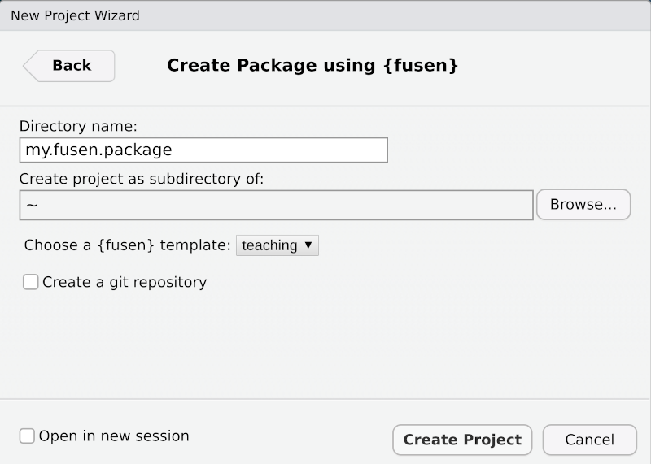

<!-- README.md is generated from README.Rmd. Please edit that file -->

```{r, include = FALSE}
knitr::opts_chunk$set(
  collapse = TRUE,
  comment = "#>",
  fig.path = "man/figures/README-",
  out.width = "100%"
)
```

# fusen 

<!-- badges: start -->
[](https://CRAN.R-project.org/package=fusen)
[](https://github.com/ThinkR-open/fusen/actions)
[](https://app.codecov.io/gh/ThinkR-open/fusen)
<!-- [](https://cran.r-project.org/package=fusen) -->
<!-- badges: end -->

{fusen} inflates a Rmarkdown file to magically create a package.

> If you know how to create a Rmarkdown file, then you know how to build a package.

Indeed, this {fusen} package is a real-world example of {fusen} use as it was itself created from the "dev_history" flat templates available in `"dev/"` folder in its GitHub repository.

## Installation

You can install the released CRAN version:

```{r, eval=FALSE}
install.packages("fusen")
```


You can install the development version of {fusen} from GitHub:

``` r
# install.packages("remotes")
remotes::install_github("ThinkR-open/fusen")
```

## You are one Rmd away from building a package! 

*{fusen} is all about correctly separating and naming chunks.*  

- Create a new directory / new project with
  - RStudio template: File > New Project > New directory > Package using {fusen} 
  - Choose the template `teaching` the first time to see how {fusen} works,
  - Choose the template `full` the second time to answer most of your questions  
```{r echo=FALSE, out.width="50%"}

```
  - *Or command line: `create_fusen("path/to/new/project", template = "teaching")`*
- Open the "dev/flat_teaching.Rmd" to start setting up the package
- In this flat Rmd template, run the first chunks named `description` asking to describe your package and license it
  + They look like these lines of code:
```{r, eval=FALSE}
fill_description(fields = list(Title = "My Awesome Package"))
usethis::use_mit_license("Sébastien Rochette")
```
- Write your analysis and functionalities following the Rmd template
  + You probably develop them with a few examples and tests
  + *For the first time, you can let the code as is, this is already the content for a working package*
- Run the following code to **transform the flat Rmd as an inflated package**
  + This will open the vignette created
```{r, eval=FALSE}
fusen::inflate(rmd = "dev/flat_teaching.Rmd", name = "get-started", check = TRUE)
```

**That's it! You built a package! A documented and tested package!**

Let's test it now:

- Install your package locally
```{r, eval=FALSE}
remotes::install_local()
```
- Restart your R session to clean environment
  + You can restart your RStudio session to let appear the "Build" tab panel
- Test functions of your package
```{r, eval=FALSE}
my.package::my_median(1:12)
```

- Test the correct documentation of the package by building its dedicated website
```{r, eval=FALSE}
# Build {pkgdown} to test it
usethis::use_pkgdown()
pkgdown::build_site()
# > See references and articles
```

## Description of the Rmd template

As I said earlier, this is all about using the correct split and name for your chunks.

- Follow the `"dev/flat_template.Rmd"` template to write your documentation and build your functions and test your examples.  
  - Chunk named `function` gets the code of a function
  - Chunk named `example` gets the code for examples of using the function. This will be used for function `@examples` and will be kept for the vignette. 
    + As chunk names should be unique in the future vignette, you can add function names like `example-myfunction`, `example-myotherfunction`, ...
  - Chunk named `tests` gets the code for unit testing
  - Chunk named `development` gets the code for development purposes, usually only used once like {usethis} functions
- **Inflate** the flat Rmd template to transform it as a package with functions, unit tests and the current Rmd transformed as a vignette. And check.

_Note that the `"flat*.Rmd"` files created with templates `full` and `teaching` are indeed working examples that can directly be inflated._  


> You can also have a look at [{squirrels.fusen}](https://github.com/statnmap/squirrels.fusen) that has been built to present the method. Follow the commits: https://github.com/statnmap/squirrels.fusen/commits/main

## How to maintain a {fusen}? Can I use {fusen} with old-way packages?

There is a dedicated vignette to answer this: https://thinkr-open.github.io/fusen/articles/Maintain-packages-with-fusen.html

- **Option 1**: Modifications are only added to the "flat_template.Rmd" file, which then is inflated to update all packages files
- **Option 2**: Modifications are realized in the package files directly, and the "flat_template.Rmd" file must be protected from any use.

> Advice : Use git as soon as possible, this will avoid losing your work if you made some modifications in the wrong place

## Who is {fusen} for?

When you write a Rmarkdown file (or a vignette), you create a documentation for your analysis (or package). Inside, you write some functions, you test your functions with examples and you maybe write some unit tests to verify the outputs. This is even more true if you follow this guide : ['Rmd first': When development starts with documentation](https://rtask.thinkr.fr/when-development-starts-with-documentation/)
After that, you need to move your functions and scripts in the correct place. Let {fusen} do that for you!

*{fusen} is first addressed to people who never wrote a package before* but know how to write a Rmarkdown file. Understanding package infrastructure and correctly settling it can be frightening. This package may help them do the first step!

*{fusen} is also addressed to more advanced developers who are fed up with switching* between R files, tests files, vignettes. In particular, when changing arguments of a function, we need to change examples, unit tests in multiple places. Here, you can do it in one place. No risk to forget one. Think also about code review: everything related to one function is at the same place.  


## Why is this package named {fusen} ?

A fusen is an origami. It is a flat piece of paper that you fold in a specific way so that at the end, you can magically inflate it to let a nice box appear.

```{r, echo=FALSE, out.width="25%"}
knitr::include_graphics("man/figures/fusen_seb_crop_small.jpg")
```

Similarly, the {fusen} package uses a flat Rmd template, that you fill in a specific way so that at the end, you can magically `inflate()` it to let a nice package appear.

<details><summary> Click here to fold your {fusen}…</summary>
</details>

## Acknowledgments

- Thanks to Deemah who asked me to go further 'Rmd first' after my presentation at useR 2019 in Toulouse: ['The "Rmd first" method: when projects start with documentation'](https://github.com/statnmap/prez/blob/master/2019-07_useR_Toulouse.pdf) (Video on Youtube: https://youtu.be/cB1BCxFbhtk). 
- Thanks to @rundel and its package {parsermd} who helped me get back in this project with ease : https://github.com/rundel/parsermd
- Thanks to the [ThinkR team](https://rtask.thinkr.fr) who adopted this package for its daily production.

## Code of Conduct

Please note that the {fusen} project is released with a [Contributor Code of Conduct](https://contributor-covenant.org/version/2/0/CODE_OF_CONDUCT.html). By contributing to this project, you agree to abide by its terms.


